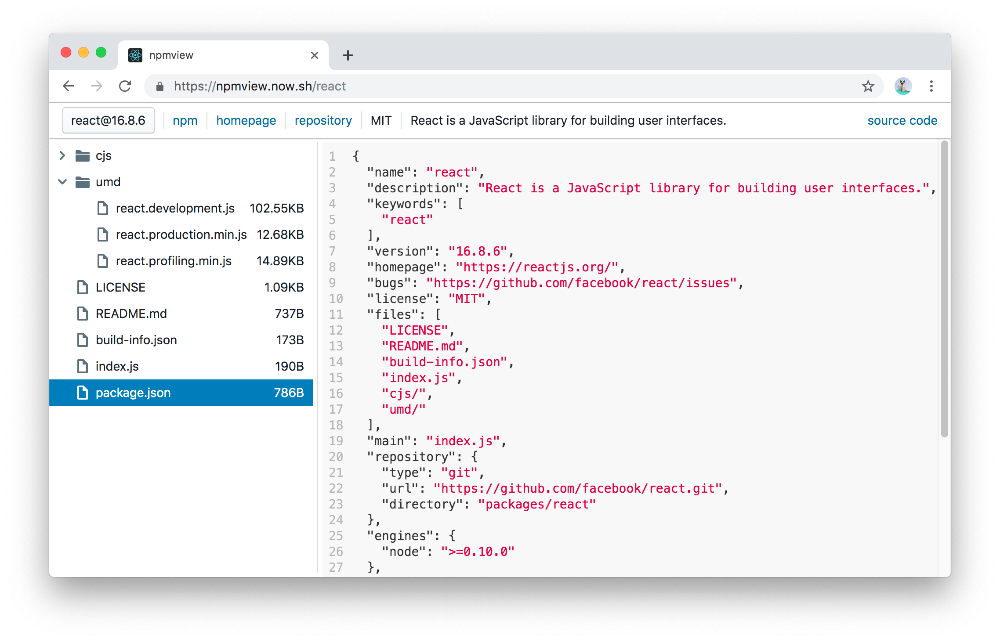

# npmview

A web application to view npm package files. | https://npmview.vercel.app



## Self-hosting for private NPM

Use `REACT_APP_UNPKG_URL` env to customize API, which should be UNPKG compatible:

```sh
REACT_APP_UNPKG_URL=https://your-private-unpkg.org yarn build
```

## Credits

- [UNPKG](https://unpkg.com)

## License

MIT
